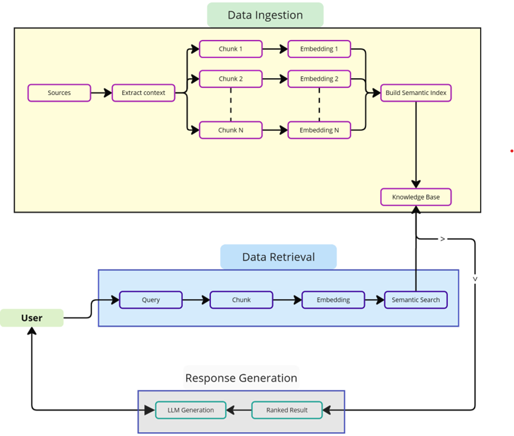

# Retrieval Augmented Generation(RAG)

[বাংলা সংস্করণ পড়ুন](./README.bn.md)

### What is RAG (Retrieval-Augmented Generation)?
RAG (Retrieval-Augmented Generation) is a hybrid model that combines two key components:

- Information retrieval (fetching relevant documents or passages from a large dataset)
- Text generation (using a language model to generate coherent responses).
  
The key idea behind RAG is to improve the accuracy and relevance of language models by allowing them to retrieve supporting information during inference, instead of relying solely on the data seen during training. This is especially helpful for answering questions that require up-to-date or domain-specific knowledge.

##### Example:
Imagine you ask a RAG-based model, “What are the latest trends in AI?”

1. The model first retrieves documents or paragraphs related to recent AI trends from a knowledge base (e.g., a collection of news articles or research papers).
2. Then, it generates a response by summarizing the retrieved documents in the context of your query.

### Why was RAG introduced? Why do we need it?
RAG was introduced to solve the limitations of traditional language models like GPT, BERT, or BART, which generate responses purely based on what they have seen during training. These models are often:

- Static: They cannot access new or unseen information, which limits their ability to generate answers about events that happened after their training.
- Memory-limited: They can only store a fixed amount of information, making it impossible to capture all possible facts or knowledge, especially in large domains.

RAG comes to address these issues by augmenting the generation process with *external retrieval*:

- It allows the model to retrieve up-to-date and domain-specific information dynamically from an external knowledge base during inference.
- This helps the model generate more accurate, informative, and contextually relevant answers.
##### Example:
Traditional models like GPT-3 might struggle to answer, “Who won the 2024 Olympic Games?” if they were trained before that year. However, a RAG model can retrieve relevant information about the 2024 Olympics from a knowledge base and then generate a correct response.

Link to the sample section: [Link Text](#####Example).

